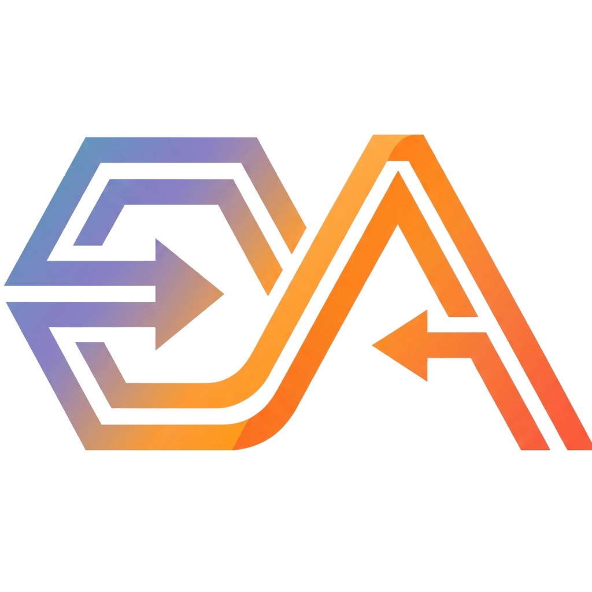
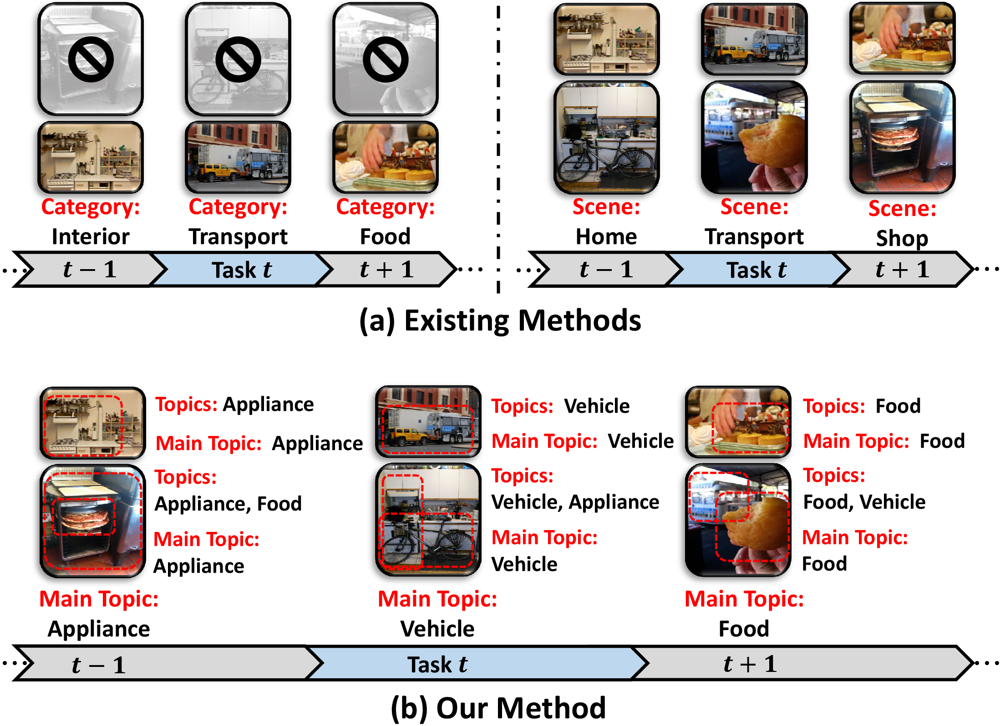
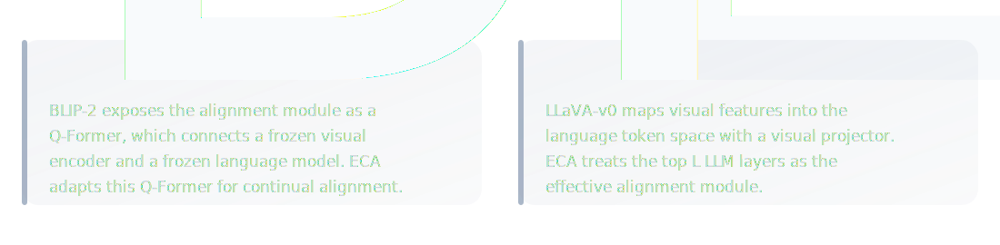
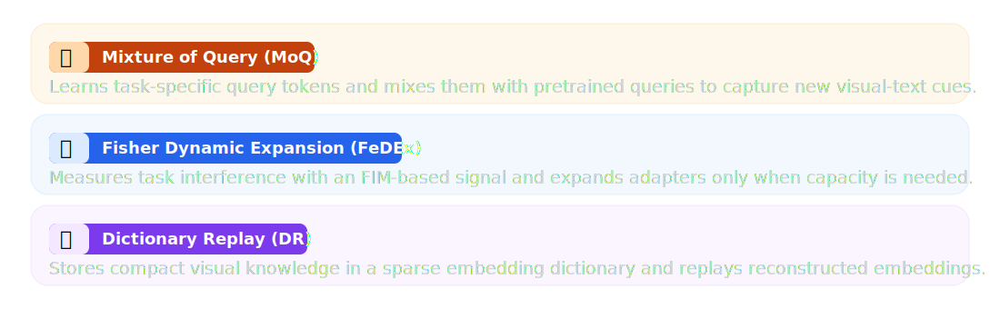
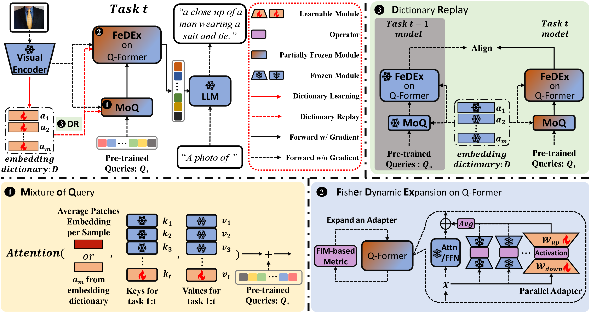
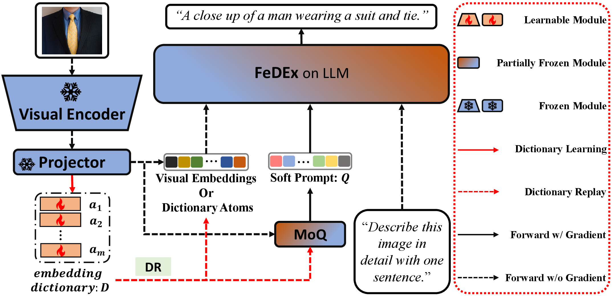
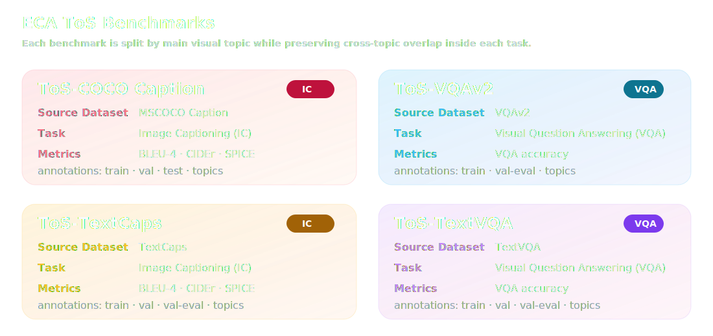
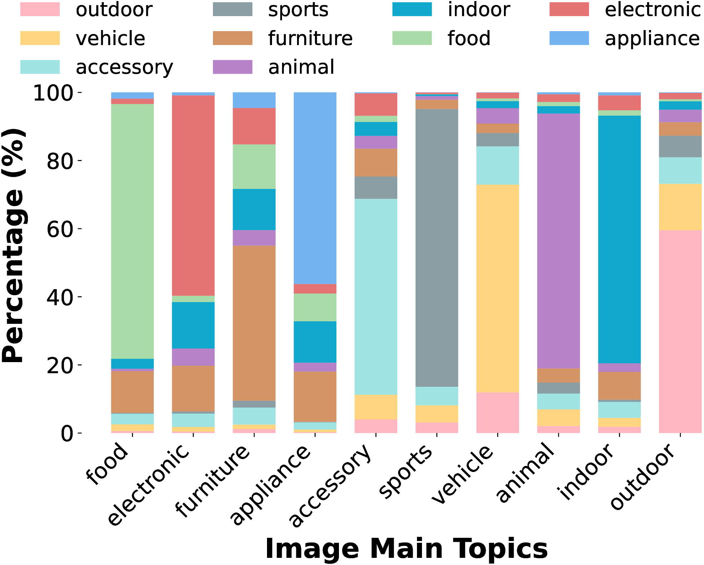
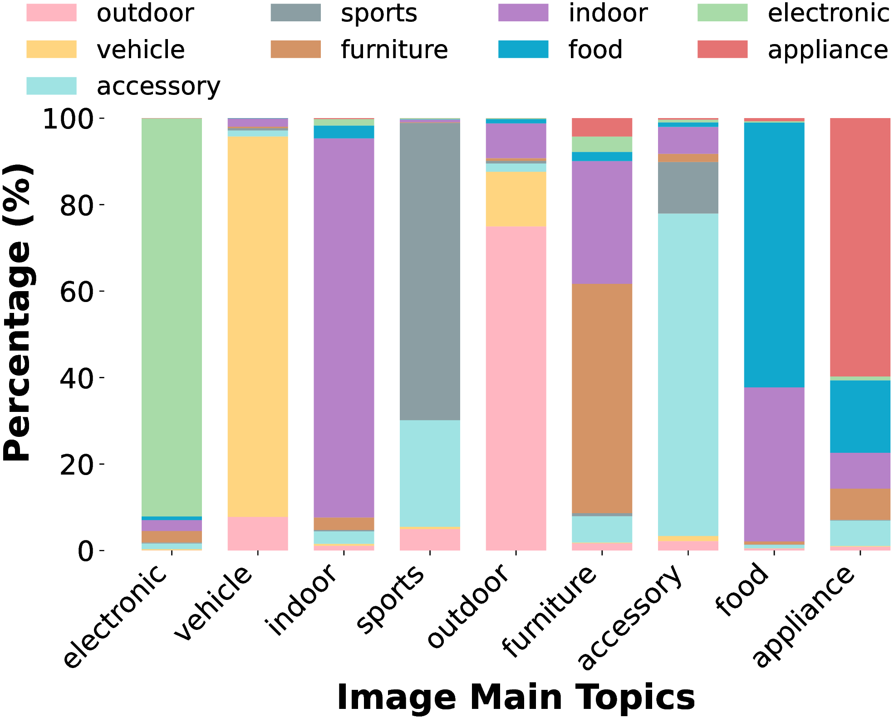
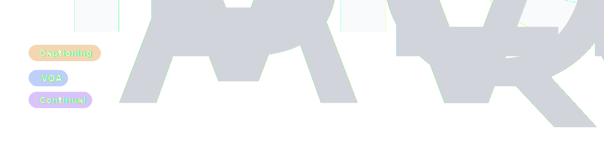

<div align="center">

<picture>
  <source media="(prefers-color-scheme: light)" srcset="content/pictures/eca_icon.svg">
  <source media="(prefers-color-scheme: dark)" srcset="content/pictures/eca_icon_2.svg">
  
</picture>

<h1 style="font-size: 2.45em; font-weight: 900; line-height: 1.16; margin: 16px auto 14px auto; max-width: 980px; text-wrap: balance;">ECA: Efficient Continual Alignment for Open-Ended Image-to-Text Generation</h1>

<p><strong>ICML 2026</strong> | Exemplar-free continual learning for OpenITG</p>

<p>
  <a href="content/ICML_2026_ECA_CR.pdf"></a>
  <a href="#benchmarks-and-topic-splits"></a>
  <a href="#method"></a>
  <a href="#backbone-coverage"></a>
</p>

<p>Jiangtao Kong, Peijun Zhao, Chun-Fu Chen, Youngwook Do, Shaohan Hu, Tianyi Zhou, Huajie Shao</p>

</div>

---

<a id="paper-introduction"></a>

<p align="center">
  
</p>

<h3 id="overview" style="font-size: 1.45em; font-weight: 800; margin-top: 24px; margin-bottom: 12px;">Overview</h3>

<div style="font-size: 1.08em; line-height: 1.65">

<p>ECA addresses <strong>incremental learning for Open-ended Image-to-Text Generation</strong>, where a vision-language model must keep generating accurate and context-aware text as visual distributions change over time. This setting covers <strong>image captioning</strong> and <strong>open-ended VQA</strong>, and it reflects a common deployment scenario where new images arrive from evolving environments.</p>

<p>The main challenge is <strong>continual alignment</strong>. Pretrained VLMs already provide strong visual and language representations, but their alignment module must be adapted when new topics appear. Directly updating this module can improve the current task while weakening the image-text associations learned from earlier tasks.</p>

<p>ECA keeps the major pretrained modules frozen and learns only lightweight alignment components. It uses <strong>Mixture of Query (MoQ)</strong>, <strong>Fisher Dynamic Expansion (FeDEx)</strong>, and <strong>Dictionary Replay (DR)</strong> to learn new tasks without storing raw exemplars from previous tasks.</p>

</div>

<h3 id="why-this-problem-is-different" style="font-size: 1.45em; font-weight: 800; margin-top: 24px; margin-bottom: 12px;">Why This Problem Is Different</h3>

<table>
<tr>
<td width="42%" valign="top">

Existing continual image-to-text protocols often build tasks from disjoint object categories or scene labels. This gives clear task boundaries, but it also removes many natural images that contain multiple topics. As a result, the task sequence becomes less similar to the visual streams that models face in deployment.

ECA uses <strong>main topic splits</strong>. Each image is assigned to a task by its dominant semantic topic, while other visible topics remain in the sample. The tasks still shift over time, but shared concepts can appear across different tasks.

This setting makes continual learning more realistic. The model must learn the new dominant topic while preserving alignment for earlier concepts that may reappear later.

</td>
<td width="58%" valign="top" align="center">

<br>
<em>Main-topic split with realistic cross-topic overlap.</em>
</td>
</tr>
</table>

<h3 id="method" style="font-size: 1.45em; font-weight: 800; margin-top: 24px; margin-bottom: 12px;">Method</h3>

<div style="font-size: 1.04em; line-height: 1.65; margin-bottom: 18px;">
<p><strong>ECA adapts the alignment path instead of the full vision-language model.</strong> The vision encoder and language model remain frozen. New knowledge is learned through lightweight modules placed where visual representations are connected to language generation.</p>
</div>


<h4 style="font-size: 1.22em; font-weight: 800; margin-top: 22px; margin-bottom: 10px;">❓ Which VLM architectures does ECA support</h4>

ECA is instantiated on BLIP-2-style VLMs and further extended to projector-based MLLMs such as LLaVA-v0. In both cases, ECA updates the alignment module while keeping the major pretrained modules frozen.

<div align="center">
  
</div>

<h4 style="font-size: 1.22em; font-weight: 800; margin-top: 22px; margin-bottom: 10px;">❓ What does ECA comprise</h4>

<div align="center">
  
</div>

<h4 style="font-size: 1.22em; font-weight: 800; margin-top: 22px; margin-bottom: 10px;">❓ How is ECA instantiated</h4>

<h4 style="font-size: 1.18em; font-weight: 800; margin-top: 14px;">BLIP-2-style VLMs</h4>

<p>For BLIP-2-style VLMs, a frozen visual encoder produces patch embeddings. MoQ aggregates task-specific queries with pretrained queries, FeDEx equips the Q-Former with expandable parallel adapters, and DR replays the embedding dictionary to retain former alignment.</p>

<div align="center">
  
  <br>
  <em>ECA instantiated on BLIP-2-style VLMs.</em>
</div>

<h4 style="font-size: 1.18em; font-weight: 800; margin-top: 22px;">Projector-based MLLMs</h4>

<p>For projector-based MLLMs, a frozen visual encoder with a pretrained projector produces visual tokens. MoQ generates soft prompt tokens, FeDEx adapts the top L LLM layers, and DR replays dictionary atoms as visual tokens to preserve past visual semantics.</p>

<div align="center">
  
  <br>
  <em>ECA instantiated on projector-based MLLMs.</em>
</div>

<h3 id="benchmarks-and-topic-splits" style="font-size: 1.45em; font-weight: 800; margin-top: 24px; margin-bottom: 12px;">Benchmarks</h3>

<div style="font-size: 1.04em; line-height: 1.65; margin-bottom: 16px;">
<p>To evaluate continual alignment in OpenITG, we build four benchmarks from MSCOCO Caption, VQAv2, TextCaps, and TextVQA. Each benchmark is split by the main topic of an image instead of disjoint object or scene labels. This keeps overlapping semantics inside each task and creates a sequence where the dominant visual topic shifts over time.</p>
</div>

<p style="line-height: 1.6; margin: 0 0 12px 0;">Each card reports the source dataset, the OpenITG task category, the evaluation metric, and the finalized ToS annotation files. Following the paper, the benchmarks fall into two OpenITG task categories, Image Captioning (IC) and Visual Question Answering (VQA).</p>

<div align="center">
  <a href="https://huggingface.co/datasets/Snowball0823/ECA-ToS-Benchmarks/tree/main/annotations">
    
  </a>
</div>

<p align="center"><em>Click the card panel to open the Hugging Face annotation repository. Individual annotation files are linked below.</em></p>

| Benchmark | Annotation files |
| --- | --- |
| ToS-COCO Caption | [train](https://huggingface.co/datasets/Snowball0823/ECA-ToS-Benchmarks/blob/main/annotations/coco/tos_coco_caption_train.json) · [val](https://huggingface.co/datasets/Snowball0823/ECA-ToS-Benchmarks/blob/main/annotations/coco/tos_coco_caption_val.json) · [test](https://huggingface.co/datasets/Snowball0823/ECA-ToS-Benchmarks/blob/main/annotations/coco/tos_coco_caption_test.json) · [topics](https://huggingface.co/datasets/Snowball0823/ECA-ToS-Benchmarks/blob/main/annotations/coco/tos_coco_style_topic_metadata.json) |
| ToS-VQAv2 | [train](https://huggingface.co/datasets/Snowball0823/ECA-ToS-Benchmarks/blob/main/annotations/coco/tos_vqav2_train.json) · [val-eval](https://huggingface.co/datasets/Snowball0823/ECA-ToS-Benchmarks/blob/main/annotations/coco/tos_vqav2_val_eval.json) · [topics](https://huggingface.co/datasets/Snowball0823/ECA-ToS-Benchmarks/blob/main/annotations/coco/tos_coco_style_topic_metadata.json) |
| ToS-TextCaps | [train](https://huggingface.co/datasets/Snowball0823/ECA-ToS-Benchmarks/blob/main/annotations/text/tos_textcaps_caption_train.json) · [val](https://huggingface.co/datasets/Snowball0823/ECA-ToS-Benchmarks/blob/main/annotations/text/tos_textcaps_caption_val.json) · [val-eval](https://huggingface.co/datasets/Snowball0823/ECA-ToS-Benchmarks/blob/main/annotations/text/tos_textcaps_caption_val_eval.json) · [topics](https://huggingface.co/datasets/Snowball0823/ECA-ToS-Benchmarks/blob/main/annotations/text/tos_text_style_topic_metadata.json) |
| ToS-TextVQA | [train](https://huggingface.co/datasets/Snowball0823/ECA-ToS-Benchmarks/blob/main/annotations/text/tos_textvqa_train.json) · [val](https://huggingface.co/datasets/Snowball0823/ECA-ToS-Benchmarks/blob/main/annotations/text/tos_textvqa_val.json) · [val-eval](https://huggingface.co/datasets/Snowball0823/ECA-ToS-Benchmarks/blob/main/annotations/text/tos_textvqa_val_eval.json) · [topics](https://huggingface.co/datasets/Snowball0823/ECA-ToS-Benchmarks/blob/main/annotations/text/tos_text_style_topic_metadata.json) |

<h4 style="font-size: 1.22em; font-weight: 800; margin-top: 20px; margin-bottom: 10px;">Main-topic distributions</h4>

<p style="line-height: 1.65; margin-bottom: 14px;">The plots show the topic composition inside each main-topic task. A task is defined by its dominant topic, but other visible topics remain in the samples.</p>

<table>
<tr>
<td width="50%" align="center" valign="top">

<br>
<em>MSCOCO-derived splits for ToS-COCO Caption and ToS-VQAv2.</em>
</td>
<td width="50%" align="center" valign="top">

<br>
<em>TextCaps-derived splits for ToS-TextCaps and ToS-TextVQA.</em>
</td>
</tr>
</table>

<h3 id="results-snapshot" style="font-size: 1.45em; font-weight: 800; margin-top: 24px; margin-bottom: 12px;">Results Snapshot</h3>

The main results below are reported with a pretrained BLIP-2 backbone. The visual encoder and LLM are frozen, and ECA is instantiated on the Q-Former alignment module. The parameter column reports trainable parameters only and is checked against Table 1 and Table 2 in the paper.

<div align="center">
  
</div>

<table align="center">
<thead>
<tr>
<th>Benchmark</th>
<th>Metric</th>
<th align="right">Trainable Params</th>
<th align="right">Avg ↑</th>
<th align="right">BWT ↑</th>
<th align="right">FWT ↑</th>
</tr>
</thead>
<tbody>
<tr><td>ToS-COCO Caption</td><td>BLEU-4</td><td align="right">12.29M</td><td align="right">43.42</td><td align="right">-0.64</td><td align="right">7.39</td></tr>
<tr><td>ToS-COCO Caption</td><td>CIDEr</td><td align="right">12.29M</td><td align="right">125.56</td><td align="right">-1.86</td><td align="right">20.58</td></tr>
<tr><td>ToS-COCO Caption</td><td>SPICE</td><td align="right">12.29M</td><td align="right">23.80</td><td align="right">-0.35</td><td align="right">3.00</td></tr>
<tr><td>ToS-VQAv2</td><td>VQA Acc</td><td align="right">21.74M</td><td align="right">68.05</td><td align="right">1.81</td><td align="right">16.38</td></tr>
<tr><td>ToS-TextCaps</td><td>BLEU-4</td><td align="right">21.74M</td><td align="right">30.05</td><td align="right">-0.18</td><td align="right">12.13</td></tr>
<tr><td>ToS-TextCaps</td><td>CIDEr</td><td align="right">21.74M</td><td align="right">103.03</td><td align="right">1.94</td><td align="right">39.22</td></tr>
<tr><td>ToS-TextCaps</td><td>SPICE</td><td align="right">21.74M</td><td align="right">16.86</td><td align="right">0.14</td><td align="right">4.39</td></tr>
<tr><td>ToS-TextVQA</td><td>VQA Acc</td><td align="right">21.74M</td><td align="right">38.13</td><td align="right">2.36</td><td align="right">19.30</td></tr>
</tbody>
</table>

---

<a id="codebase"></a>

<p align="center">
  
</p>

<h3 id="backbone-coverage" style="font-size: 1.45em; font-weight: 800; margin-top: 24px; margin-bottom: 12px;">Backbone Support</h3>

<div style="display: flex; flex-direction: column; gap: 10px; margin: 12px 0 24px 0; font-size: 1.04em; line-height: 1.65;">

<div style="padding: 10px 12px; border-radius: 10px; background: rgba(100, 116, 139, 0.08);">
<span style="font-size: 1.08em; margin-right: 8px;">☑️</span><strong>BLIP-2</strong> · <a href="models/ECA_Q/"><code>models/ECA_Q/</code></a> · <a href="configs/train/ecaq_cl_train_cap.yaml"><code>configs/train/ecaq_cl_train_cap.yaml</code></a>
</div>

<div style="padding: 10px 12px; border-radius: 10px; background: rgba(100, 116, 139, 0.08);">
<span style="font-size: 1.08em; margin-right: 8px;">☑️</span><strong>LLaVA-v0</strong> · <a href="models/ECA_LlaVA/"><code>models/ECA_LlaVA/</code></a> · <a href="configs/train/eca_llava_cl_train_cap.yaml"><code>configs/train/eca_llava_cl_train_cap.yaml</code></a>
</div>

<div style="padding: 10px 12px; border-radius: 10px; background: rgba(100, 116, 139, 0.08);">
<span style="font-size: 1.08em; margin-right: 8px;">☑️</span><strong>InternVL-2.5</strong> · <a href="models/ECA_InternVL/"><code>models/ECA_InternVL/</code></a> · <a href="configs/train/eca_internvl_cl_train_textvqa.yaml"><code>configs/train/eca_internvl_cl_train_textvqa.yaml</code></a>
</div>

<div style="padding: 10px 12px; border-radius: 10px; background: rgba(100, 116, 139, 0.05); color: #94a3b8;">
<span style="font-size: 1.08em; margin-right: 8px;">⬜</span><strong>Qwen2.5-VL</strong> · To be supported
</div>

<div style="padding: 10px 12px; border-radius: 10px; background: rgba(100, 116, 139, 0.05); color: #94a3b8;">
<span style="font-size: 1.08em; margin-right: 8px;">⬜</span><strong>Qwen3-VL</strong> · To be supported
</div>

</div>

<h3 id="methods-reproduced" style="font-size: 1.45em; font-weight: 800; margin-top: 24px; margin-bottom: 12px;">Methods Reproduced</h3>

We include the adapted baseline implementations used in the paper so the continual OpenITG comparisons can be reproduced under the same data split, backbone, and evaluation protocol.

<ul style="margin: 14px 0 24px 1.25em; padding: 0; font-size: 1.04em; line-height: 1.75;">
<li style="margin: 8px 0;"><span style="display: inline-block; padding: 2px 8px; border-radius: 6px; background: rgba(30, 41, 59, 0.82); color: #f8fafc; font-family: ui-monospace, SFMono-Regular, Menlo, Consolas, monospace; font-weight: 700;">LwF</span> <a href="https://arxiv.org/abs/1606.09282">[paper]</a> · <a href="tasks/eca_q_captioning_lwf.py">code</a> · <a href="configs/train/ecaq_lwf_cl_train_cap.yaml">config</a> <span style="color: #94a3b8;">BLIP-2 ☑️ · LLaVA-v0 ☑️ · InternVL-2.5 ⬜</span></li>
<li style="margin: 8px 0;"><span style="display: inline-block; padding: 2px 8px; border-radius: 6px; background: rgba(30, 41, 59, 0.82); color: #f8fafc; font-family: ui-monospace, SFMono-Regular, Menlo, Consolas, monospace; font-weight: 700;">EWC</span> <a href="https://arxiv.org/abs/1612.00796">[paper]</a> · <a href="tasks/eca_q_captioning.py">code</a> · <a href="configs/train/ecaq_ewc_cl_train_cap.yaml">config</a> <span style="color: #94a3b8;">BLIP-2 ☑️ · LLaVA-v0 ☑️ · InternVL-2.5 ☑️</span></li>
<li style="margin: 8px 0;"><span style="display: inline-block; padding: 2px 8px; border-radius: 6px; background: rgba(30, 41, 59, 0.82); color: #f8fafc; font-family: ui-monospace, SFMono-Regular, Menlo, Consolas, monospace; font-weight: 700;">Dual-Prompt</span> <a href="https://arxiv.org/abs/2204.04799">[paper]</a> · <a href="models/CODA_Prompt/">code</a> · <a href="configs/train/ecaq_dual_cl_train_cap.yaml">config</a> <span style="color: #94a3b8;">BLIP-2 ☑️ · LLaVA-v0 ⬜ · InternVL-2.5 ⬜</span></li>
<li style="margin: 8px 0;"><span style="display: inline-block; padding: 2px 8px; border-radius: 6px; background: rgba(30, 41, 59, 0.82); color: #f8fafc; font-family: ui-monospace, SFMono-Regular, Menlo, Consolas, monospace; font-weight: 700;">CODA-Prompt</span> <a href="https://openaccess.thecvf.com/content/CVPR2023/html/Smith_CODA-Prompt_COntinual_Decomposed_Attention-Based_Prompting_for_Rehearsal-Free_Continual_Learning_CVPR_2023_paper.html">[paper]</a> · <a href="models/CODA_Prompt/">code</a> · <a href="configs/train/ecaq_coda_cl_train_cap.yaml">config</a> <span style="color: #94a3b8;">BLIP-2 ☑️ · LLaVA-v0 ⬜ · InternVL-2.5 ⬜</span></li>
<li style="margin: 8px 0;"><span style="display: inline-block; padding: 2px 8px; border-radius: 6px; background: rgba(30, 41, 59, 0.82); color: #f8fafc; font-family: ui-monospace, SFMono-Regular, Menlo, Consolas, monospace; font-weight: 700;">MoE-LoRA</span> <a href="https://arxiv.org/abs/2403.08350">[paper]</a> · <a href="models/MoELora/">code</a> · <a href="configs/train/ecaq_lora_cl_train_cap.yaml">config</a> <span style="color: #94a3b8;">BLIP-2 ☑️ · LLaVA-v0 ☑️ · InternVL-2.5 ⬜</span></li>
<li style="margin: 8px 0;"><span style="display: inline-block; padding: 2px 8px; border-radius: 6px; background: rgba(30, 41, 59, 0.82); color: #f8fafc; font-family: ui-monospace, SFMono-Regular, Menlo, Consolas, monospace; font-weight: 700;">ModalPrompt</span> <a href="https://aclanthology.org/2025.emnlp-main.609/">[paper]</a> · <a href="models/ModalPrompt_Q/">code</a> · <a href="configs/train/eca_llava_mp_cl_train_textvqa.yaml">config</a> <span style="color: #94a3b8;">BLIP-2 ☑️ · LLaVA-v0 ☑️ · InternVL-2.5 ☑️</span></li>
</ul>

<h3 id="quick-start" style="font-size: 1.45em; font-weight: 800; margin-top: 24px; margin-bottom: 12px;">Quick Start</h3>

<h4 style="font-size: 1.22em; font-weight: 850; margin-top: 24px; margin-bottom: 10px;">🧰 Environment</h4>

ECA registers BLIP-2, LLaVA-v0, and InternVL modules at startup.

```bash
conda create -n eca python=3.8.19 -y
conda activate eca

# Use the same PyTorch and MKL stack as the local ECA environment.
conda install pytorch==2.0.1 torchvision==0.15.2 torchaudio==2.0.2 pytorch-cuda=11.7 numpy==1.24.3 "mkl=2023.1.*" "intel-openmp=2023.1.*" -c pytorch -c nvidia -c defaults -y

# Caption metrics use pycocoevalcap from LAVIS requirements.
# SPICE and METEOR require Java.
conda install -c conda-forge openjdk=8 -y

# Optional: uv only accelerates Python package installation.
pip install uv

# Install dependency packages explicitly. Use pip if uv is unavailable.
uv pip install -r third_party/LAVIS/requirements.txt
uv pip install -r requirements/eca_extra.txt

# Re-apply the tested Transformer stack after dependency resolution.
uv pip install transformers==4.37.2 tokenizers==0.15.1 huggingface-hub==0.23.4

# Install local source packages in editable mode without re-solving dependencies.
uv pip install --no-deps -e third_party/LAVIS
uv pip install --no-deps -e third_party/adapters-0.2.2
uv pip install --no-deps -e third_party/LLaVA
uv pip install --no-deps -e third_party/InternVL/internvl_chat

```

👉 `uv` is optional. It only speeds up Python package installation. If you do not use it, replace each `uv pip install` command with `pip install`.

👉 Caption and VQA evaluation use COCO metric packages, including `pycocoevalcap` and `pycocotools`. SPICE and METEOR also need Java at runtime. The official `pycocoevalcap` (click [link](https://github.com/salaniz/pycocoevalcap) for details) README lists Java 1.8.0, while a system Java installation also works if `java` is available on `PATH`.

👉 `third_party/LAVIS/` and `third_party/adapters-0.2.2/` are patched third-party packages. Use the copies in this repository so the path handling, BLIP-Diffusion gate, and adapter fusion changes are available. The patch files are in `third_party/patches/`.

👉 `third_party/LLaVA/` and `third_party/InternVL/` are compatible LLaVA-v0 and InternVL source snapshots for reproducibility. You can replace them with official LLaVA and InternVL installations if `import llava` and `import internvl` expose the same APIs. The default checkpoint roots are now `checkpoints/LLaVA/` and `checkpoints/InternVL/`, which keeps source code and model weights separated.

👉 ECA does not use BLIP-Diffusion, so the bash scripts disable its model registration by default with `export ECA_ENABLE_BLIP_DIFFUSION=${ECA_ENABLE_BLIP_DIFFUSION:-0}`. Set `ECA_ENABLE_BLIP_DIFFUSION=1` only if you want to restore the original LAVIS BLIP-Diffusion registration and have installed its optional dependencies.

<h4 style="font-size: 1.22em; font-weight: 850; margin-top: 24px; margin-bottom: 10px;">🗂️ ToS Annotations</h4>

The ToS benchmark annotations are hosted on 🤗 Hugging Face at [Snowball0823/ECA-ToS-Benchmarks](https://huggingface.co/datasets/Snowball0823/ECA-ToS-Benchmarks). Download them into the runtime `cache/` layout before training or evaluation.

```bash
huggingface-cli download Snowball0823/ECA-ToS-Benchmarks \
  --repo-type dataset \
  --local-dir ECA-ToS-Benchmarks \
  --local-dir-use-symlinks False

mkdir -p cache/coco/annotations cache/TextCaps
cp ECA-ToS-Benchmarks/annotations/coco/*.json cache/coco/annotations/
cp ECA-ToS-Benchmarks/annotations/text/*.json cache/TextCaps/
```

Images are not redistributed with the ToS annotations. Download the original MSCOCO, TextCaps, and TextVQA images from their official sources and place them under `cache/coco/images/` and `cache/TextCaps/images/`.

<h4 style="font-size: 1.22em; font-weight: 850; margin-top: 24px; margin-bottom: 10px;">🧩 Pretrained Checkpoints</h4>

🎯 **BLIP-2**

BLIP-2 weights are managed by LAVIS. On the first run, LAVIS downloads the BLIP-2 OPT checkpoint and `facebook/opt-2.7b` automatically, so no manual BLIP-2 folder is needed under `checkpoints/`.

🎯 **InternVL**

InternVL weights are loaded from local paths in the configs. Download the model sizes you need into `checkpoints/InternVL/`:

```bash
mkdir -p checkpoints/InternVL

huggingface-cli download OpenGVLab/InternVL2_5-1B \
  --local-dir checkpoints/InternVL/InternVL2_5-1B \
  --local-dir-use-symlinks False

huggingface-cli download OpenGVLab/InternVL2_5-4B \
  --local-dir checkpoints/InternVL/InternVL2_5-4B \
  --local-dir-use-symlinks False

huggingface-cli download OpenGVLab/InternVL2_5-8B \
  --local-dir checkpoints/InternVL/InternVL2_5-8B \
  --local-dir-use-symlinks False
```

🎯 **LLaVA-v0**

LLaVA-v0 requires the full merged checkpoint. Follow the official LLaVA weight preparation instructions and place the final checkpoint at `checkpoints/LLaVA/llava-7b-v0`. If you use a config with a separate base model path, place Vicuna at `checkpoints/LLaVA/vicuna-7b-v0`.

🎯 **Checkpoint links**

👉 🤗 InternVL2.5-1B [link](https://huggingface.co/OpenGVLab/InternVL2_5-1B)

👉 🤗 InternVL2.5-4B [link](https://huggingface.co/OpenGVLab/InternVL2_5-4B)

👉 🤗 InternVL2.5-8B [link](https://huggingface.co/OpenGVLab/InternVL2_5-8B)

👉  LLaVA official weight instructions [link](https://github.com/haotian-liu/LLaVA#llava-weights)


<h4 style="font-size: 1.22em; font-weight: 850; margin-top: 24px; margin-bottom: 10px;">🚀 Train</h4>

Example ECA training command:

```bash
bash train.sh configs/train/ecaq_cl_train_cap.yaml
```

For multi-GPU training, set `NPROC_PER_NODE` before launching:

```bash
NPROC_PER_NODE=4 bash train.sh configs/train/ecaq_cl_train_cap.yaml
```

Before launching a fresh run, check whether the selected config contains stale `resume_ckpt_path`, `output_dir`, or local checkpoint paths from a previous machine.


<h3 id="config-map" style="font-size: 1.45em; font-weight: 800; margin-top: 24px; margin-bottom: 12px;">Config Map</h3>

Paper-main BLIP-2/Q-Former training configs:

| Benchmark | Train config |
| --- | --- |
| ToS-COCO Caption | `configs/train/ecaq_cl_train_cap.yaml` |
| ToS-VQAv2 | `configs/train/ecaq_cl_train_vqa.yaml` |
| ToS-TextCaps | `configs/train/ecaq_cl_train_textcaps.yaml` |
| ToS-TextVQA | `configs/train/ecaq_cl_train_textvqa.yaml` |

Backbone extension examples:

| Backbone | Example train config |
| --- | --- |
| LLaVA-v0 | `configs/train/eca_llava_cl_train_cap.yaml` |
| InternVL | `configs/train/eca_internvl_cl_train_textvqa.yaml` |

<h2 id="citation" style="font-size: 2.05em; font-weight: 850; margin-top: 34px; margin-bottom: 16px;">Citation</h2>

If this repository is useful for your research, please cite:

```bibtex
@inproceedings{kong2026eca,
  title = {ECA: Efficient Continual Alignment for Open-Ended Image-to-Text Generation},
  author = {Kong, Jiangtao and Zhao, Peijun and Chen, Chun-Fu and Do, Youngwook and Hu, Shaohan and Zhou, Tianyi and Shao, Huajie},
  booktitle = {Proceedings of the 43rd International Conference on Machine Learning (ICML)},
  year = {2026},
  note = {To appear}
}
```

<h2 id="acknowledgements" style="font-size: 2.05em; font-weight: 850; margin-top: 34px; margin-bottom: 16px;">Acknowledgements</h2>

This codebase builds on the following third-party projects and research code. Please also follow their licenses and usage requirements.

- [BLIP-2](https://github.com/salesforce/LAVIS/tree/main/projects/blip2) and [LAVIS](https://github.com/salesforce/LAVIS)
- [LLaVA-v0](https://github.com/haotian-liu/LLaVA) and [InternVL](https://github.com/OpenGVLab/InternVL)
- [AdapterHub adapters](https://github.com/adapter-hub/adapters)
- [DualPrompt](https://arxiv.org/abs/2204.04799), [CODA-Prompt](https://github.com/GT-RIPL/CODA-Prompt), [ModalPrompt](https://aclanthology.org/2025.emnlp-main.609/), and [CoIN](https://arxiv.org/abs/2403.08350)
- [pycocoevalcap](https://github.com/salaniz/pycocoevalcap) and [pycocotools](https://github.com/cocodataset/cocoapi)
- Source datasets including [COCO](https://cocodataset.org/), [VQAv2](https://visualqa.org/), [TextVQA](https://textvqa.org/dataset/), and [TextCaps](https://textvqa.org/textcaps/)
